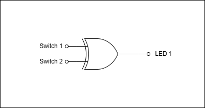

# XOR_Gate_Project

## Project Description
This project demonstrates the output of an XOR gate. Two switches of an FPGA are used as an input to the XOR gate and an LED is tied to the output.

## Required materials
1. FPGA development board - I am using the NANDLAND GO board (https://nandland.com/the-go-board/) that is based on the LATTICE ICE40 FPGA
2. Two input switches
3. One LED

## Logic circuit diagram

 
## Truth table of a 2-input XOR gate
| Switch 1 | Switch 2 | LED |
|:--------:|:--------:|:---:|
|     0    |     0    |  0  |
|     0    |     1    |  1  |
|     1    |     0    |  1  |
|     1    |     1    |  0  |

## Results
These results were obtained by using the Aldec Riviera simulator via the EDA Playground tool  
